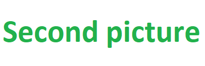

<a href="#ancora">First Anchor</a>
Text cu ghilimele = "setText"
some paragraph.
  
some other paragraph:
 
 
 
another paragraph:
 
 
 

un rand
  
alt rand
<h3> Just some repository used for learning how to use GitHub </h3>
text1 
text2 

<some_text_to_check_if_seen_as_html_tag> 
"text with double quotes" 
'text with simple quotes' 
Prima poza: 
 
A doua poza: 
 
<h1>Titlu Principal</h1>
<h3>Titlu Paragraf</h3>
<h3>Titlu Paragraf</h3>
<h3>Titlu Paragraf</h3>
<h3>Titlu Paragraf</h3>
<h3>Titlu Paragraf</h3>
<b>Subcategorie</b> 
<b>Subcategorie</b> 
<b>Subcategorie</b> 
<b>Subcategorie</b> 
<h3>Titlu Paragraf</h3>
Test text fara aliniat. 
&nbsp;&nbsp;&nbsp;Un text cu spatii la inceput. 
&nbsp;&nbsp;&nbsp;Un text foarte lung ddddddd dddddddd ddddddddd d ddddddddddd ddddddddddddddddddd ddddddddddddddddd ddddddddddddddddddd dddddddddddddddddddd ddddddddddddddddd ddddddddddddddddd dddddddddddddddd ddddddddddddddddddddddddddd ddddddddddddddddddd ddddddddddddddddddddd dddddddddddddddddd dddddddddddzzzzzzzzzz zzzzzzzzzzzzzzzzzzzzzzzzzzzzzzzzzzzzzzzzzzzzzzzzzzzzzzzzzzzzzzzzzzz

Un link la Gogu <a href = "http://www.google.com">AICI</a>.

<table>
<tr>
<td>AAAAAAAAAAAAAAAA</td>
<td>val1</td>
</tr>
<tr>
<td>BBB</td>
<td>val2</td>
</tr>
</table>

a - &ltvalue_of_b&gt = c
 
a - &lt;value_of_b&gt; = c
 

ap&#259;.
 

Continuare dupa ancora
“abc”
 
"abc"
 
’ vs '
 
don’t
 
don't
                                 
End of document.
